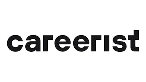

# [Python Programming](https://www.careerist.com/automation)

 

In this module, you will learn the fundamentals of the Python programming language, which serves as the foundation for
QA Automation. You will gain knowledge and hands-on experience with Python syntax, data types, control flow, functions,
and file handling. Passing 10 lessons, you will have a solid understanding of Python programming and be ready to apply
it in the context of QA Automation.

## Course Content

- Self-learning PyCharm and GitHub tutorials
- Lesson 1. Intro to the QA Automation course
- Lesson 2 Intro to Python. Numbers
- Lesson 3 Strings
- Lesson 4 Conditionals
- Lesson 5 Intro to codewars
- Lesson 6 Lists
- Lesson 7 Loops. Ranges
- Lesson 8 Functions
- Lesson 9 Dictionaries
- Lesson 10 Classes

 
 
### https://www.careerist.com/

